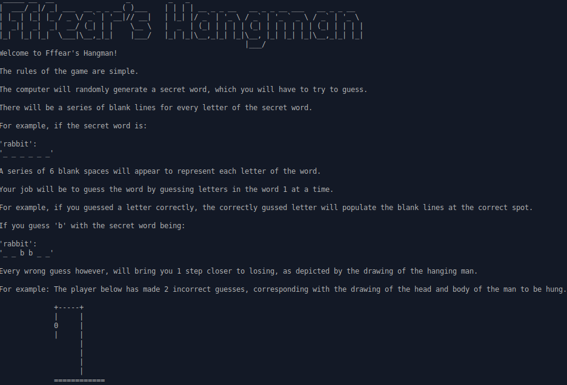
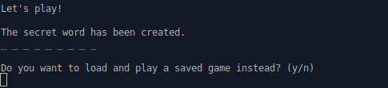
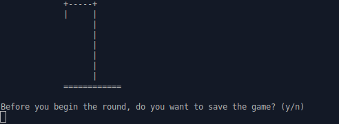
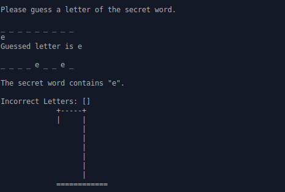
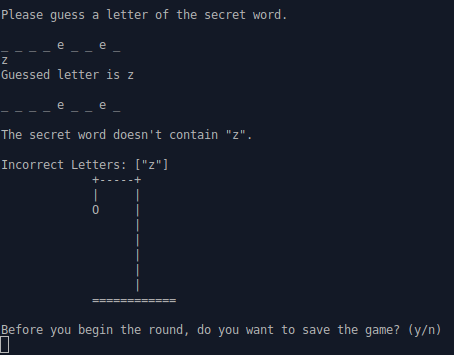

# Hangman Game
This is a Hangman game in Ruby, as part of the 'File I/O and Serialization' project in TheOdinProject Intermediate Ruby Course.

## Run the Game

To run the game, please ensure that you have Ruby installed on your machine.
Navigate into the root folder which holds the `lib` folder, and type `ruby lib/game.rb` in the command line to start the game.

## Home Screen Game

Upon entering the game, the below should appear, giving a basic description of the game.

Enter 'y' or 'n' to decide if you would like to play the game.

## Load Saved Game

You will have the option of loading a saved game to play, if you have saved a game previously.

## Save Current Game

Before the beginning of each turn, you will also have the option of saving the game.

## Guess Letters

When letters of the secret word have been guessed correctly, the position of the letters will be displayed.

If you guessed a letter incorrectly, the incorrect letter you have guessed will be added to a list of wrong letters previously guessed. Additionally, the man will be 1 step closer to being hung!

## Game Results

If you fail to guess the secret word before the man is hung, you lose.

- [Wikipedia description on the game](https://en.wikipedia.org/wiki/Hangman_(game))